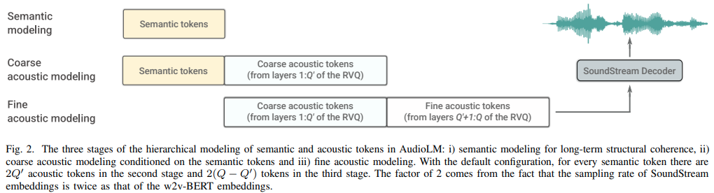

</img>

## AudioLM - Pytorch

Implementation of <a href="https://google-research.github.io/seanet/audiolm/examples/">AudioLM</a>, a Language Modeling Approach to Audio Generation out of Google Research, in Pytorch

It also extends the work for conditioning with classifier free guidance with T5. This allows for one to do text-to-audio or TTS, not offered in the paper. Yes, this means <a href="https://valle-demo.github.io/">VALL-E</a> can be trained from this repository. It is essentially the same.

Please join <a href="https://discord.gg/xBPBXfcFHd"></a> if you are interested in replicating this work in the open

This repository now also contains a MIT licensed version of <a href="https://arxiv.org/abs/2107.03312">SoundStream</a>. Once <a href="https://github.com/facebookresearch/encodec">EnCodec</a> becomes MIT licensed, then I will consider adding a wrapper for that as well for use here.

Update: AudioLM was essentially used to 'solve' music generation in the new <a href="https://github.com/lucidrains/musiclm-pytorch">MusicLM</a>

In the future, <a href="https://www.youtube.com/watch?v=olNvmUCmY8o">this movie clip</a> would no longer make any sense. You would just prompt an AI instead.

## Appreciation

- <a href="https://stability.ai/">Stability.ai</a> for the generous sponsorship to work and open source cutting edge artificial intelligence research

- <a href="https://huggingface.co/">🤗 Huggingface</a> for their amazing accelerate and transformers libraries

- <a href="https://ai.facebook.com/">MetaAI</a> for <a href="https://github.com/facebookresearch/fairseq">Fairseq</a> and the liberal license

- <a href="https://github.com/eonglints">@eonglints</a> and <a href="https://github.com/turian">Joseph</a> for offering their professional advice and expertise as well as pull requests!

- <a href="https://github.com/djqualia">@djqualia</a>, <a href="https://github.com/yigityu">@yigityu</a>, <a href="https://github.com/inspirit">@inspirit</a>, and <a href="https://github.com/BlackFox1197">@BlackFox1197</a> for helping with the debugging of soundstream

- <a href="https://github.com/zhvng">Allen</a> for catching and fixing some bugs!

- <a href="https://github.com/ilya16">Ilya</a> for finding an issue with multi-scale discriminator downsampling and for soundstream trainer improvements

- <a href="https://github.com/AndreyBocharnikov">Andrey</a> for identifying a missing loss in soundstream and guiding me through the proper mel spectrogram hyperparameters

## Install

```bash
$ pip install audiolm-pytorch
```

## Usage

### SoundStream

First, `SoundStream` needs to be trained on a large corpus of audio data

```python
from audiolm_pytorch import SoundStream, SoundStreamTrainer

soundstream = SoundStream(
    codebook_size = 1024,
    rq_num_quantizers = 8,
    attn_window_size = 128,       # local attention receptive field at bottleneck
    attn_depth = 2                # 2 local attention transformer blocks - the soundstream folks were not experts with attention, so i took the liberty to add some. encodec went with lstms, but attention should be better
)

trainer = SoundStreamTrainer(
    soundstream,
    folder = '/path/to/audio/files',
    batch_size = 4,
    grad_accum_every = 8,         # effective batch size of 32
    data_max_length_seconds = 2,  # train on 2 second audio
    num_train_steps = 10000
).cuda()

trainer.train()

# after a lot of training, you can test the autoencoding as so

audio = torch.randn(10080).cuda()
recons = soundstream(audio, return_recons_only = True) # (1, 10080) - 1 channel
```

You can also use soundstreams that are specific to `AudioLM` and `MusicLM` by importing `AudioLMSoundStream` and `MusicLMSoundStream` respectively

```python
from audiolm_pytorch import AudioLMSoundStream, MusicLMSoundStream

soundstream = AudioLMSoundStream(...) # say you want the hyperparameters as in Audio LM paper

# rest is the same as above
```

As of version `0.17.0`, you can now invoke the class method on `SoundStream` to load from checkpoint files, without having to remember your configurations.

```python
from audiolm_pytorch import SoundStream

soundstream = SoundStream.init_and_load_from('./path/to/checkpoint.pt')
```

### Hierarchical Transformers

Then three separate transformers (`SemanticTransformer`, `CoarseTransformer`, `FineTransformer`) need to be trained


ex. `SemanticTransformer`

```python
import torch
from audiolm_pytorch import HubertWithKmeans, SemanticTransformer, SemanticTransformerTrainer

# hubert checkpoints can be downloaded at
# https://github.com/facebookresearch/fairseq/tree/main/examples/hubert

wav2vec = HubertWithKmeans(
    checkpoint_path = './hubert/hubert_base_ls960.pt',
    kmeans_path = './hubert/hubert_base_ls960_L9_km500.bin'
)

semantic_transformer = SemanticTransformer(
    num_semantic_tokens = wav2vec.codebook_size,
    dim = 1024,
    depth = 6
).cuda()


trainer = SemanticTransformerTrainer(
    transformer = semantic_transformer,
    wav2vec = wav2vec,
    folder ='/path/to/audio/files',
    batch_size = 1,
    data_max_length = 320 * 32,
    num_train_steps = 1
)

trainer.train()
```

ex. `CoarseTransformer`

```python
import torch
from audiolm_pytorch import HubertWithKmeans, SoundStream, CoarseTransformer, CoarseTransformerTrainer

wav2vec = HubertWithKmeans(
    checkpoint_path = './hubert/hubert_base_ls960.pt',
    kmeans_path = './hubert/hubert_base_ls960_L9_km500.bin'
)

soundstream = SoundStream.init_and_load_from('/path/to/trained/soundstream.pt')

coarse_transformer = CoarseTransformer(
    num_semantic_tokens = wav2vec.codebook_size,
    codebook_size = 1024,
    num_coarse_quantizers = 3,
    dim = 512,
    depth = 6
)

trainer = CoarseTransformerTrainer(
    transformer = coarse_transformer,
    soundstream = soundstream,
    wav2vec = wav2vec,
    folder = '/path/to/audio/files',
    batch_size = 1,
    data_max_length = 320 * 32,
    num_train_steps = 10000
)

trainer.train()
```

ex. `FineTransformer`

```python
import torch
from audiolm_pytorch import SoundStream, FineTransformer, FineTransformerTrainer

soundstream = SoundStream.init_and_load_from('/path/to/trained/soundstream.pt')

fine_transformer = FineTransformer(
    num_coarse_quantizers = 3,
    num_fine_quantizers = 5,
    codebook_size = 1024,
    dim = 512,
    depth = 6
)

trainer = FineTransformerTrainer(
    transformer = fine_transformer,
    soundstream = soundstream,
    folder = '/path/to/audio/files',
    batch_size = 1,
    data_max_length = 320 * 32,
    num_train_steps = 10000
)

trainer.train()
```

All together now

```python
from audiolm_pytorch import AudioLM

audiolm = AudioLM(
    wav2vec = wav2vec,
    soundstream = soundstream,
    semantic_transformer = semantic_transformer,
    coarse_transformer = coarse_transformer,
    fine_transformer = fine_transformer
)

generated_wav = audiolm(batch_size = 1)

# or with priming

generated_wav_with_prime = audiolm(prime_wave = torch.randn(1, 320 * 8))

# or with text condition, if given

generated_wav_with_text_condition = audiolm(text = ['chirping of birds and the distant echos of bells'])

```

## Text Conditioned Audio Synthesis

Update: Looks like this will work, given <a href="https://valle-demo.github.io/">'VALL-E'</a>

ex. Semantic Transformer

```python
import torch
from audiolm_pytorch import HubertWithKmeans, SemanticTransformer, SemanticTransformerTrainer

wav2vec = HubertWithKmeans(
    checkpoint_path = './hubert/hubert_base_ls960.pt',
    kmeans_path = './hubert/hubert_base_ls960_L9_km500.bin'
)

semantic_transformer = SemanticTransformer(
    num_semantic_tokens = 500,
    dim = 1024,
    depth = 6,
    has_condition = True,               # this will have to be set to True
    cond_as_self_attn_prefix = True     # whether to condition as prefix to self attention, instead of cross attention, as was done in 'VALL-E' paper
).cuda()

# mock text video dataset (as an example)

# you will have to extend your own from `Dataset`, and return an audio tensor as well as a string (the audio description) in any order (the framework will autodetect and route it into the transformer)

from torch.utils.data import Dataset

class MockTextAudioDataset(Dataset):
    def __init__(self, length = 100, audio_length = 320 * 32):
        super().__init__()
        self.audio_length = audio_length
        self.len = length

    def __len__(self):
        return self.len

    def __getitem__(self, idx):
        mock_audio = torch.randn(self.audio_length)
        mock_caption = 'audio caption'
        return mock_caption, mock_audio

dataset = MockTextAudioDataset()

# instantiate semantic transformer trainer and train

trainer = SemanticTransformerTrainer(
    transformer = semantic_transformer,
    wav2vec = wav2vec,
    dataset = dataset,
    batch_size = 4,
    grad_accum_every = 8,
    data_max_length = 320 * 32,
    num_train_steps = 100000
)

trainer.train()

# after much training above

sample = trainer.generate(text = ['sound of rain drops on the rooftops'], batch_size = 1, max_length = 2) # (1, < 128) - may terminate early if it detects [eos]

```

## Multi-GPU

Because all the trainer classes uses <a href="https://huggingface.co/docs/accelerate/accelerator">🤗 Accelerator</a>, you can easily do multi gpu training by using the `accelerate` command as so

At the project root

```python
$ accelerate config
```

Then, in the same directory

```python
$ accelerate launch train.py
```

## Todo

- [x] complete CoarseTransformer
- [x] use fairseq vq-wav2vec for embeddings
- [x] add conditioning
- [x] add classifier free guidance
- [x] add unique consecutive for 
- [x] incorporate ability to use hubert intermediate features as semantic tokens, recommended by <a href="https://github.com/lucidrains/audiolm-pytorch/discussions/13">eonglints</a>
- [x] accommodate variable lengthed audio, bring in eos token
- [x] make sure unique consecutive works with coarse transformer
- [x] pretty printing all discriminator losses to log
- [x] handle when generating semantic tokens, that last logits may not be necessarily the last in the sequence given unique consecutive processing
- [x] complete sampling code for both Coarse and Fine Transformers, which will be tricky
- [x] make sure full inference with or without prompting works on the `AudioLM` class
- [x] complete full training code for soundstream, taking care of discriminator training
- [x] add efficient gradient penalty for discriminators for soundstream
- [x] wire up sample hz from sound dataset -> transformers, and have proper resampling within during training - think about whether to allow for dataset to have sound files of varying or enforce same sample hz
- [x] full transformer training code for all three transformers
- [x] refactor so semantic transformer has a wrapper to that handles unique consecutives as well as wav to hubert or vq-wav2vec
- [x] simply not self attend to eos token on the prompting side (semantic for coarse transformer, coarse for fine transformer)
- [x] add structured dropout from forgetful causal masking, far better than traditional dropouts
- [x] figure out how to suppress logging in fairseq
- [x] assert that all three transformers passed into audiolm is compatible

- [ ] figure out how to do the normalization across each dimension mentioned in the paper, but ignore it for v1 of the framework
- [ ] DRY a little at the end
- [ ] test with speech synthesis for starters
- [ ] add option to use flash attention
- [ ] simplify training even more within AudioLM class
- [ ] cli tool, something like `audiolm generate <wav.file | text>` and save generated wav file to local directory
- [ ] return a list of waves in the case of variable lengthed audio
- [ ] just take care of the edge case in coarse transformer text conditioned training, where the raw wave is resampled at different frequencies. autodetermine how to route based on length
- [ ] allow for specialized relative positional embeddings in fine transformer based on absolute matching positions of quantizers between coarse and fine

## Citations

```bibtex
@inproceedings{Borsos2022AudioLMAL,
  title  = {AudioLM: a Language Modeling Approach to Audio Generation},
  author = {Zal{\'a}n Borsos and Rapha{\"e}l Marinier and Damien Vincent and Eugene Kharitonov and Olivier Pietquin and Matthew Sharifi and Olivier Teboul and David Grangier and Marco Tagliasacchi and Neil Zeghidour},
  year   = {2022}
}
```

```bibtex
@misc{https://doi.org/10.48550/arxiv.2107.03312,
  title  = {SoundStream: An End-to-End Neural Audio Codec},
  author = {Zeghidour, Neil and Luebs, Alejandro and Omran, Ahmed and Skoglund, Jan and Tagliasacchi, Marco},
  publisher = {arXiv},
  url    = {https://arxiv.org/abs/2107.03312},
  year   = {2021}
}
```

```bibtex
@misc{shazeer2020glu,
    title   = {GLU Variants Improve Transformer},
    author  = {Noam Shazeer},
    year    = {2020},
    url     = {https://arxiv.org/abs/2002.05202}
}
```

```bibtex
@article{Shazeer2019FastTD,
    title   = {Fast Transformer Decoding: One Write-Head is All You Need},
    author  = {Noam M. Shazeer},
    journal = {ArXiv},
    year    = {2019},
    volume  = {abs/1911.02150}
}
```

```bibtex
@article{Ho2022ClassifierFreeDG,
    title   = {Classifier-Free Diffusion Guidance},
    author  = {Jonathan Ho},
    journal = {ArXiv},
    year    = {2022},
    volume  = {abs/2207.12598}
}
```

```bibtex
@misc{crowson2022,
    author  = {Katherine Crowson},
    url     = {https://twitter.com/rivershavewings}
}
```

```bibtex
@misc{ding2021cogview,
    title   = {CogView: Mastering Text-to-Image Generation via Transformers},
    author  = {Ming Ding and Zhuoyi Yang and Wenyi Hong and Wendi Zheng and Chang Zhou and Da Yin and Junyang Lin and Xu Zou and Zhou Shao and Hongxia Yang and Jie Tang},
    year    = {2021},
    eprint  = {2105.13290},
    archivePrefix = {arXiv},
    primaryClass = {cs.CV}
}
```

```bibtex
@article{Liu2022FCMFC,
    title   = {FCM: Forgetful Causal Masking Makes Causal Language Models Better Zero-Shot Learners},
    author  = {Hao Liu and Xinyang Geng and Lisa Lee and Igor Mordatch and Sergey Levine and Sharan Narang and P. Abbeel},
    journal = {ArXiv},
    year    = {2022},
    volume  = {abs/2210.13432}
}
```

```bibtex
@inproceedings{anonymous2022normformer,
    title   = {NormFormer: Improved Transformer Pretraining with Extra Normalization},
    author  = {Anonymous},
    booktitle = {Submitted to The Tenth International Conference on Learning Representations },
    year    = {2022},
    url     = {https://openreview.net/forum?id=GMYWzWztDx5},
    note    = {under review}
}
```

```bibtex
@article{Li2021LocalViTBL,
    title   = {LocalViT: Bringing Locality to Vision Transformers},
    author  = {Yawei Li and K. Zhang and Jie Cao and Radu Timofte and Luc Van Gool},
    journal = {ArXiv},
    year    = {2021},
    volume  = {abs/2104.05707}
}
```

```bibtex
@misc{liu2021swin,
    title   = {Swin Transformer V2: Scaling Up Capacity and Resolution},
    author  = {Ze Liu and Han Hu and Yutong Lin and Zhuliang Yao and Zhenda Xie and Yixuan Wei and Jia Ning and Yue Cao and Zheng Zhang and Li Dong and Furu Wei and Baining Guo},
    year    = {2021},
    eprint  = {2111.09883},
    archivePrefix = {arXiv},
    primaryClass = {cs.CV}
}
```

```bibtex
@inproceedings{Ma2022MegaMA,
    title   = {Mega: Moving Average Equipped Gated Attention},
    author  = {Xuezhe Ma and Chunting Zhou and Xiang Kong and Junxian He and Liangke Gui and Graham Neubig and Jonathan May and Luke Zettlemoyer},
    year    = {2022}
}
```

```bibtex
@misc{gilmer2023intriguing
    title  = {Intriguing Properties of Transformer Training Instabilities},
    author = {Justin Gilmer, Andrea Schioppa, and Jeremy Cohen},
    year   = {2023},
    status = {to be published - one attention stabilization technique is circulating within Google Brain, being used by multiple teams}
}
```
